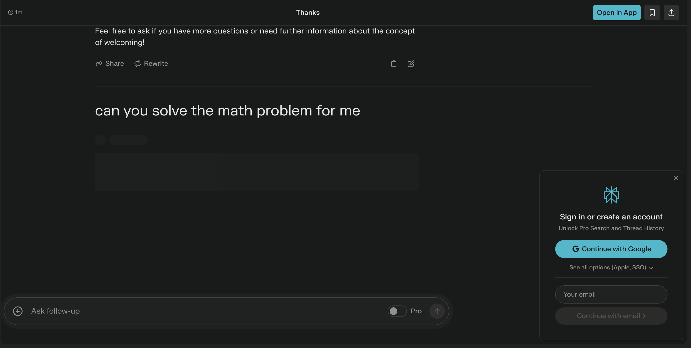
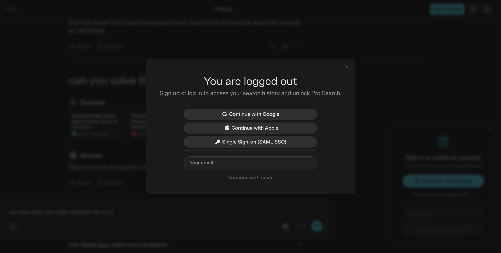

# chatModelSelenium
## Web Automation using Selenium Hub
## Rest Api using Flask

**Features**:
- WebScarping using python flask to get the data from Perplexity.ai 
- Handle cloud Flare and google recaptcha using Proxy 
- Use Selenium hub to create multiple browsers instances.
- Every User has there own session and every user has there own
 object so every time when user hit the api it will get the response accordingly

#Refercne image how i lunch the Perplexity Web and send quires to them and get the data

###******************************************

### Handle the login dialog if showing on the screen press the cross button by using code 

